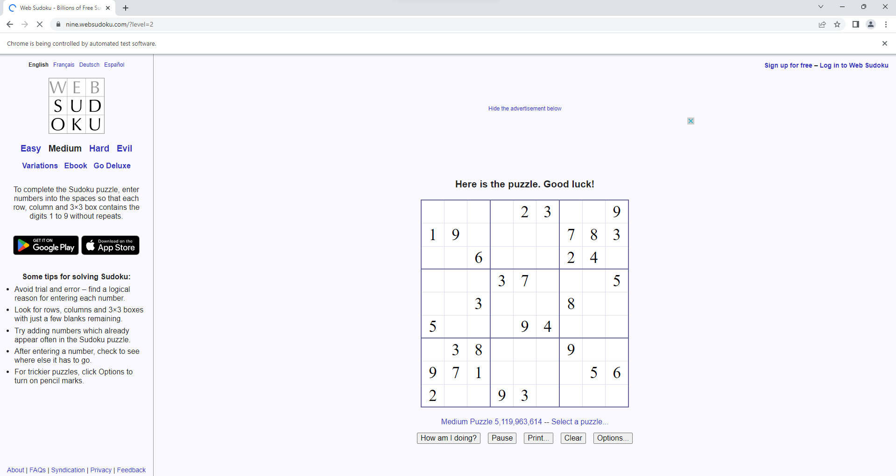
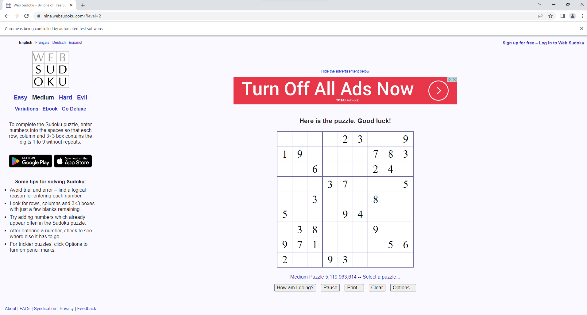
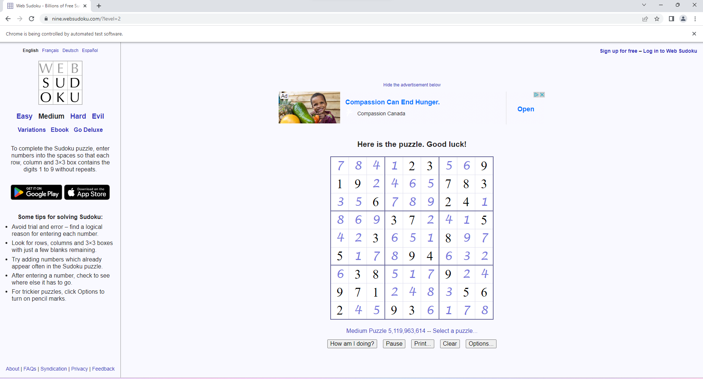
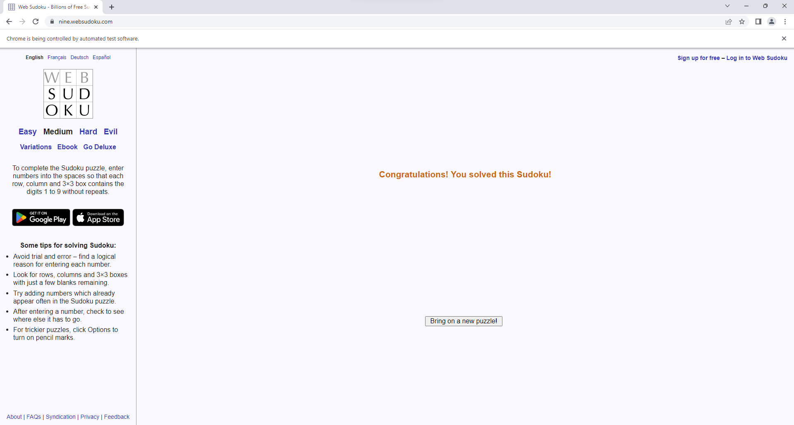
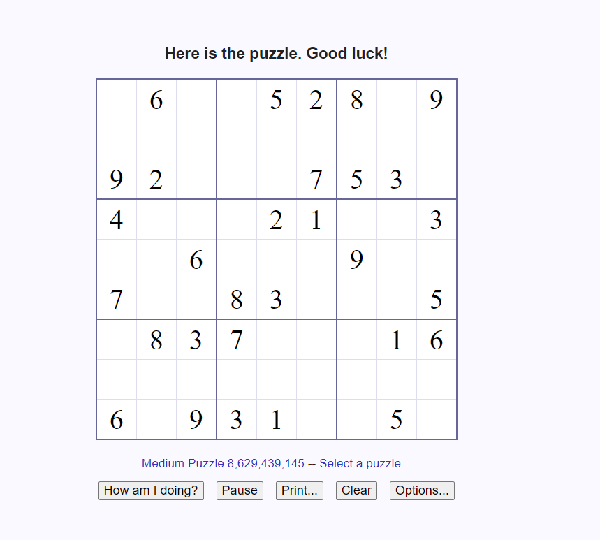
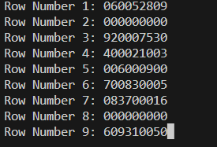
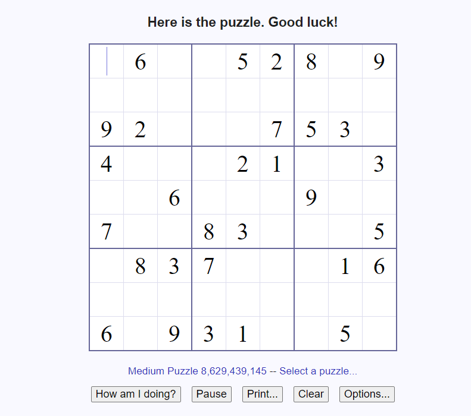
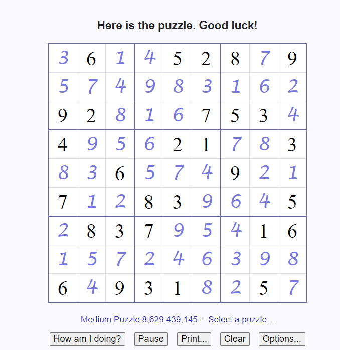

# Sudoku Solver on Website
Automated solving sudoku puzzles on a website using selenium and pyautogui, with a custom solver. Tested on Windows

## Required installation
```python
pip install pyautogui
pip install selenium
pip install webdriver-manager
```
## Running the Program
```python
py sudoku_solver.py x # Using selenium. x is an integer indicating the number of puzzles to solve, the default value is 1 if it is not specified.
py sudoku_pyautogui.py # Using pyautogui. This file is only used for me in learning how to use pyautogui, not recommended for automation usage. 
```
# Application usage

## sudoku_solver.py
After running the program, a new google chrome browser instance will be created, directing to a specific sudoku website



Once the page has been fully loaded, the program scraps the initial sudoku puzzle state from the website and attempts to find the solution using the custom solver.



The program will then apply the solution to the sudoku website




The program will be directed to a new puzzle by pressing the "Bring me a new puzzle!" button based on the remaining number of puzzles to solve

## sudoku_pyautogui.py

Initially, the user will be asked to manually enter the current board state onto the terminal based on the website. 


| Initial board state | Terminal Input|
| --------------- | --------------- |
|  | |

After entering the required fields, the program will attemp to find the solution using the custom solver

There will then be a delay of 2 seconds, allowing the user to move the mouse and click on the top left cell of the sudoku board. 



After two seconds have passed, the program will simulate key and mouse presses to apply the solution onto the sudoku board.




---
# Additional information
The website that is used for the sudoku puzzles is https://nine.websudoku.com/
